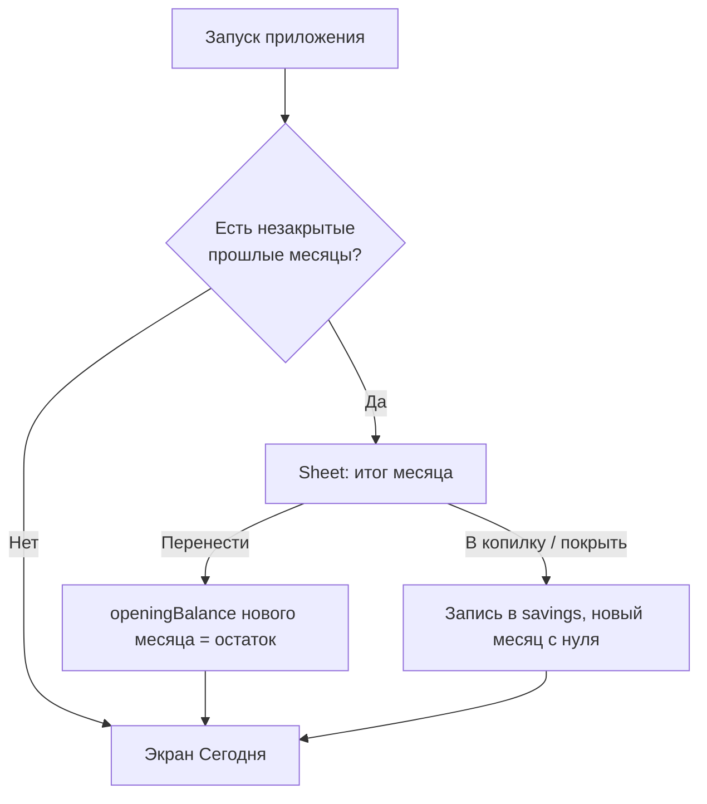

- # Деньги — PWA-трекер расходов в стиле iOS 26

## Решения по стеку

- Vite + React + TypeScript, Tailwind v4 (CSS-переменные для токенов темы).
- Хранение: IndexedDB через Dexie + `dexie-react-hooks` (`useLiveQuery`) — реактивность без Redux/Zustand.
- PWA: `vite-plugin-pwa` (Workbox, precache всего бандла, `display: standalone`), iOS-мета и `apple-touch-icon`.
- Анимации: `motion` (framer-motion) для sheet-ов и spring-переходов.
- Деньги — целые копейки (`number`), формат через `Intl.NumberFormat('ru-RU')`. Никаких float-сумм.
- Vitest для юнит-тестов движка бюджета (единственное место, где ошибка стоит дорого).

## Модель данных (`src/db/db.ts`)

```ts
settings   { id: 1, currency: 'RUB', startDate: '2026-09-19', theme: 'auto', onboarded: boolean }
months     { id: '2026-09', limitMinor, accrualStartDay, accrualDays, openingBalanceMinor,
             status: 'open' | 'closed', closedAt?, carryDecision?: 'carry' | 'savings' }
tx         { id, monthId, date: 'YYYY-MM-DD', amountMinor, categoryId?, note?, createdAt }
categories { id, name, emoji, color, order }        // опциональны при вводе
savings    { id, date, amountMinor, kind: 'initial'|'rollover'|'cover'|'manual', note? }
```

Копилка = сумма записей `savings` (журнал, а не одно число) — так видно историю переносов и можно откатить.

## Движок бюджета (`src/lib/budget.ts`)

Дневная норма и накопление без дрейфа округления:

```ts
const dailyRateMinor = Math.round(month.limitMinor / month.accrualDays);
// накопленное считаем от лимита, а не умножением нормы — суммарно всегда ровно limitMinor
const accruedMinor = Math.round(month.limitMinor * accruedDays / month.accrualDays);
const balanceMinor = month.openingBalanceMinor + accruedMinor - spentMinor;
```

`accruedDays = clamp(today - accrualStartDay + 1, 0, accrualDays)` — норма начисляется целиком в начале дня, включая текущий. Никаких cron/таймеров: баланс всегда вычисляется от даты, поэтому приложение корректно «догоняет» себя после недели без запуска.

Старт посреди месяца: в онбординге спрашиваем дату старта и начальный баланс, из даты берём `accrualStartDay`, `accrualDays = daysInMonth - startDay + 1`.

Закрытие месяца: при запуске ищем месяцы со `status: 'open'`, у которых период истёк, и показываем sheet с итогом. Для плюса — «перенести в новый месяц» или «в копилку»; для минуса — «перенести долг» или «покрыть из копилки». Решение пишет `carryDecision`, создаёт `openingBalanceMinor` нового месяца и при необходимости запись в `savings`.



## Экраны

- Онбординг: месячный лимит, сумма копилки, дата старта. Большие цифры, кастомная клавиатура, свайп между шагами.
- Сегодня: крупный накопленный баланс (плюс — зелёный, минус — красный), кольцо прогресса месяца, дневная норма и «потрачено сегодня», последние траты, плавающая кнопка «+».
- Ввод траты: bottom sheet с кастомным keypad (не системная клавиатура — она ломает верстку на iOS). Сумма вводится крупно, сохранение одним тапом; категория и заметка — опциональные чипы над клавиатурой, дата по умолчанию сегодня.
- История: группировка по дням с суммой дня, свайп-влево для удаления, тап для правки.
- Статистика: разбивка по категориям, столбцы по дням, темп трат против нормы.
- Настройки: лимит, копилка, категории, тема, экспорт/импорт JSON, сброс.

Навигация — нижний glass tab bar (Сегодня / История / Статистика / Настройки) с учётом `safe-area-inset-bottom`.

## Стиль iOS 26

- Стекло — `background: rgba(...)` как база, поверх в `@supports` блоке `backdrop-filter: blur(20px) saturate(180%)` **вместе с** `-webkit-backdrop-filter` (в Safari CSS-переменные внутри `-webkit-backdrop-filter` не резолвятся — значения хардкодим). SVG `feDisplacementMap`-рефракцию не используем: в WebKit она не работает и роняет GPU-процесс.
- Крупные радиусы (22-28px), внутренняя светлая кромка `inset 0 1px 0 rgba(255,255,255,.35)`, мягкие тени, фоновые градиентные блобы, чтобы стекло было чем размывать.
- Шрифты: `-apple-system`, для сумм — `ui-rounded` + `font-variant-numeric: tabular-nums`.
- Large title, сжимающийся при скролле; sheet-ы с grabber и drag-to-dismiss на spring-анимации; `prefers-reduced-motion` отключает пружины.
- Обязательная мобильная гигиена: `viewport-fit=cover` + `env(safe-area-inset-*)`, `100dvh`, `overscroll-behavior: none`, `-webkit-touch-callout: none`, `user-select: none` вне полей ввода, `font-size: 16px` у инпутов (иначе Safari зумит).
- Тёмная тема по умолчанию, светлая по `prefers-color-scheme`, `theme-color` под статус-бар.

## Установка на iPhone

Service worker требует HTTPS, поэтому для теста на телефоне поднимаем dev-сервер с `--host` и `vite-plugin-mkcert`, либо туннель (`cloudflared`). В `index.html` — `apple-mobile-web-app-capable`, `apple-mobile-web-app-status-bar-style: black-translucent`, `apple-touch-icon` 180x180, иконки 192/512 + maskable в манифесте.